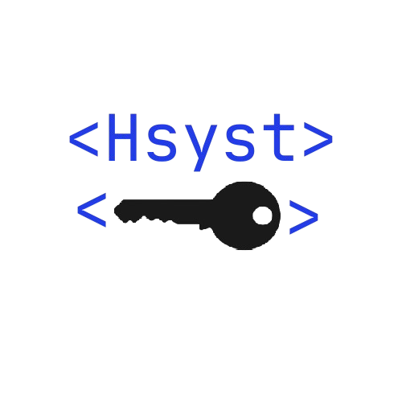

# Sistema de Login (Hsyst Auth)

## Descrição
Criar um sistema de autênticação realmente seguro, para finalmente tornar essa joça algo que não seja uma bomba atômica de XSS.

## Objetivos

- Criar o formulário de login (algo bonito dessa vez)
- Criar API para receber os logins e registros (criptografia usando JWT e AES)

## Prática

### Passos para o Sistema de Login:

#### Formulário:
- **Email:** humberto@123.123
- **Senha:** pass123

1. O formulário pede à API:  
   `site.com/crypt_jwt?email=humberto@123.123&senha=pass123`
   
2. A API responde:  
   `Token_JWT_Com_Esses_Dois_Dados`
   
3. O formulário passa os dados para:  
   `site.com/crypt?email=humberto@123.123&senha=pass123&key=Token_JWT_Com_Esses_Dois_Dados`
   
4. A API responde:  
   `Token_AES`
   
5. O formulário passa os dados para:  
   `site.com/register?token=Token_AES`
   
6. O formulário fala ao usuário.

7. O usuário clica no botão e é redirecionado ao login.

---

#### Formulário:
- **Email:** humberto@123.123
- **Senha:** pass123

1. O formulário pede à API:  
   `site.com/crypt_jwt?email=humberto@123.123&senha=pass123`
   
2. A API responde:  
   `Token_JWT_Com_Esses_Dois_Dados`
   
3. O formulário passa os dados para:  
   `site.com/crypt?email=humberto@123.123&senha=pass123&key=Token_JWT_Com_Esses_Dois_Dados`
   
4. A API responde:  
   `Token_AES`
   
5. O formulário passa os dados para:  
   `site.com/login?token=Token_AES`
   
6. O formulário fala ao usuário.

7. O usuário clica no botão e é redirecionado ao painel.
